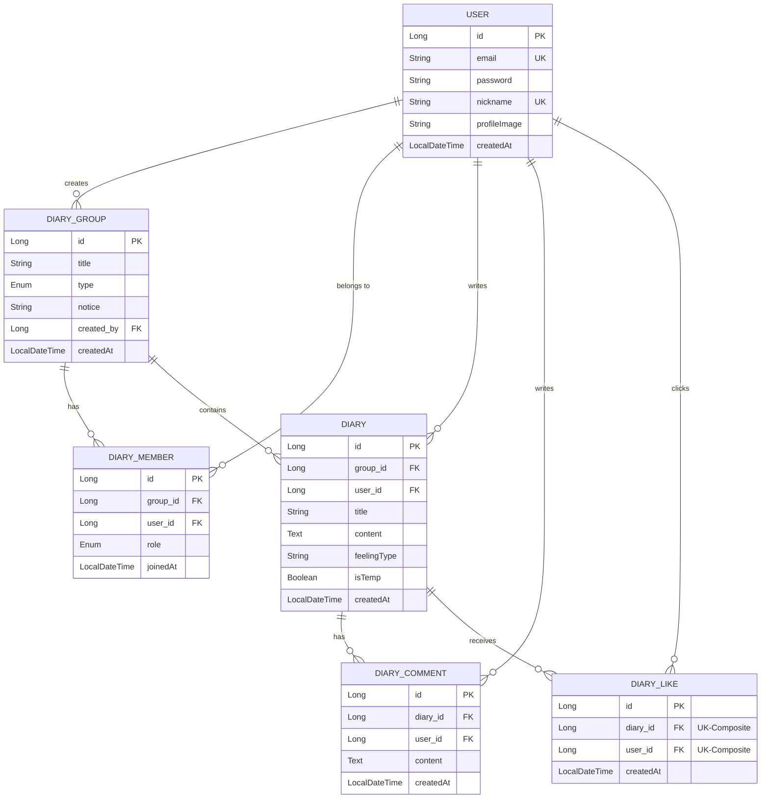

# DB

user(사용자) - id(PK), email, password, nickname, profile_image

diary_group(일기 개인인지 공유인지) - id(PK), title, type(개인/공유), notice(한줄공지), created_by(FK - user.id ,다이어리 생성자), created_at(생성일)

diary_member(공유 다이어리 멤버) - id(PK), group_id(FK - diary_group.id), user_id(FK - user.id), role(owner/member), joined_at(다이어리 참가날짜)

diary(일기) - id(PK), user_id(FK- 작성자), group_id(FK - diary_group.id 어느 다이어리인지), title, content, image_url, feeling_type(감정), created_at, is_temp(임시저장)

diary_comment(댓글) - id(PK), diary_id(FK - diary.id 어느 다이어리 댓글인지), content, created_by(FK - user.id, 댓글 작성자), created_at

diary_like(좋아요) - diary_id(FK-좋아요 누른 일기 id), user_id(FK-좋아요 누른 사람), created_at(좋아요 누른 시간)

- 나중에 된다면 알람, 채팅 테이블도?
- diary에 is_temp(임시 저장 기능)-추후 추가

# 화면 구상

1. 메인 + 로그인 / 회원가입 페이지

- 들어가면 바로 로그인 페이지 뜨게
- 밑에 회원가입 전환 버튼

2. 다이어리 메인 홈

- 다이어리 목록
- 다이어리 생성

3. 각 다이어리 메인 홈

- 일기들 리스트로 띄우는 피드
- 캘린더로 볼 수 있는 페이지
  - 날짜 눌렀을 때 그날 쓴거 보이게
- 멤버
- 일기 작성 버튼

4. 일기 상세 페이지

- 내 프로필 + 이미지 띄우기
- 일기 제목, 내용
- 좋아요
- 댓글

5. 일기 작성 페이지

- 제목, 내용, 감정 선택
- 이미지 추가

6. 마이 페이지

- 닉네임, 프로필 이미지 수정

# API 명세서

## 로그인 / 회원가입

### 1. 회원가입 (Register) ✅

- **목적:** 새로운 사용자 계정 생성
- **HTTP 메소드:** POST
- **URL:** `/auth/register`

---

### 2. 로그인 (Login) ✅

- **목적:** 사용자 인증 후 JWT 토큰 발급
- **HTTP 메소드:** POST
- **URL:** `/auth/login`

---

### 3. 프로필 조회 (Get User Profile) ✅

- **목적:** 특정 사용자 정보 조회
- **HTTP 메소드:** GET
- **URL:** `/users/me`

---

### 4. 프로필 수정 (Update Profile) ✅

- **목적:** 닉네임 및 프로필 이미지 변경
- **HTTP 메소드:** PUT
- **URL:** `/users/me`

---

## 다이어리 관련

### 1. 개인 / 공유 다이어리 생성 ✅

- **목적:** 개인/공유 다이어리 생성
- **HTTP 메소드:** POST
- **URL:**`/groups`

---

### 2. 내 다이어리 목록 ✅

- **목적:** 내가 참여하고 있는 개인/공유 다이어리 목록
- **HTTP메소드:** GET
- **URL** `/groups`

---

### 3. 공지 수정 ✅

- **목적:** 내가 참여하고 있는 다이어리의 공지 수정
- **HTTP메소드:** PUT
-**URL** `/groups/{group_id}`

---

### 4. 멤버 초대 ✅

- **목적:** 공유 다이어리의 생성자일 때 다이어리에 멤버 초대
- **HTTP메소드:** POST
- **URL** `/groups/members/{group_id}`

---

### 5. 멤버 조회 ✅

- **목적:** 참여 중인 다이어리의 멤버 조회
- **HTTP메소드:** GET
- **URL** `/groups/members/{group_id}`

---

### 6. 삭제

#### 6-1. 다이어리 그룹 삭제 ( 방장만 가능 ) ✅

- **목적:** 다이어리 그룹 삭제 ( 방장만 삭제 가능)
- **HTTP메소드:** DELETE
- **URL** `/groups/{groupId}`

#### 6-2. 다이어리 탈퇴 ( 멤버만 가능 ) ✅

- **목적:** 다이어리 삭제
- **HTTP메소드:** DELETE
- **URL** `/groups/leave/{groupId}`

---

## 다이어리 작성

### 1. 다이어리 작성 ✅

- **목적:** 일기 내용 작성
- **HTTP메소드:** POST
- **URL** `/diaries/{group_id}`

---

### 2. 다이어리 조회

#### 2-1. 다이어리 상세 내용 조회 ✅

- **목적:** 일기 상세 내용 조회
- **HTTP메소드:** GET
- **URL:** `/diaries/detail/{diary_id}`

---

### 2-2. 다이어리 조회(필터링) ✅

- **목적:** 일기 내용 날짜별 / 회원별
- **HTTP메소드:** GET
- **URL:** `/diaries/{group_id}`

---

### 3. 다이어리 수정 ✅

- **목적:** 일기 내용 수정
- **HTTP메소드:** PUT
- **URL** `/diaries/{diary_id}`

---

### 4. 다이어리 삭제 ✅

- **목적:** 일기 삭제
- **HTTP메소드:** DELETE
- **URL** `/diaries/{diary_id}`

---

## 다이어리 댓글 작성 및 좋아요

### 1. 댓글 작성 ✅

- **목적:** 댓글 내용 수정
- **HTTP메소드:** POST
- **URL** `/diaries/comment/{diary_id}`

---

### 2. 댓글 조회 ✅

- **목적:** 댓글 조회
- **HTTP메소드:** GET
- **URL** `/diaries/comment/{diary_id}`

---

### 3. 댓글 수정 ✅

- **목적:** 댓글 내용 수정
- **HTTP메소드:** PUT
- **URL** `/comment/{comment_id}`

---

### 4. 댓글 삭제 ✅

- **목적:** 댓글 내용 삭제
- **HTTP메소드:** DELETE
- **URL** `/comment/{comment_id}`

---

### 5. 좋아요 추가/삭제 ✅

- **목적:** 좋아요 추가
- **HTTP메소드:** POST
- **URL** `/diaries/like/{diary_id}`

---